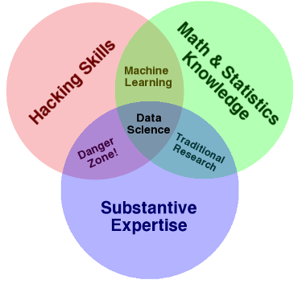
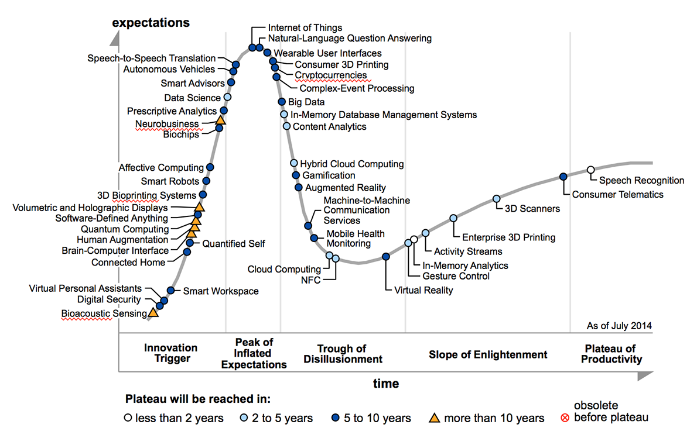

*(Disclaimer: This post was originally published on the [Data Pub Blog](http://datapub.cdlib.org/2015/11/10/data-science-meets-academia/) of the [California Digital Library](http://www.cdlib.org/))*

First Big Data and Data Science, then Data Driven and Data Informed. Even before I changed job titles---from Physicist to Data Scientist---I spent a good bit of time pondering what makes everyone so excited about these things, and whether they have a place in the academy. 

Data Science is an incredibly young and [flaming hot](https://speakerd.s3.amazonaws.com/presentations/c47f606815d34e7e8b7b1ca8be55eff1/Why_Data_Science__2_.pdf) field (Searching for 'Data Science' on Google Search yields about 283,000,000 results in 0.48 seconds [!] and the count is rising). The promises---and accordingly the stakes---of Data Science are high, and seem to follow a classic [Hype Cycle](https://en.wikipedia.org/wiki/Hype_cycle). Nevertheless, Data Science is already having major impacts on all aspects of life, with personalized advertisement and [self-quantification](https://en.wikipedia.org/wiki/Quantified_Self) leading the charge. But is there a place for Data Science in Academia? To try and answer this question, we will first dive into trying to understand more about Data Science itself, from lofty promises to practical workflows, and later point out some potential (big-picture) academic applications.

## Yet another attempt at defining Data Science ...

There are gazillions of blogs, articles, diagrams, and other information channels that aim to define this new and still-fuzzy term "Data Science," and it will still be some years before we achieve consensus. But at least for now there is some agreement surrounding the main ingredients; Drew Conway summarizes them nicely in his [Venn diagram](http://drewconway.com/zia/2013/3/26/the-data-science-venn-diagram)

In this popular [tweet](https://twitter.com/josh_wills/status/198093512149958656), Josh Wills defines a Data Scientist as an individual '*who is better at statistics than any software engineer and better at software engineering than any statistician*'.  This definition just barely captures some of the basics. Referring back to the Venn diagram, a Data Scientist finds her/himself at the intersection of Statistics, Machine Learning, and a particular business need (in academic parlance, a research question).

- **Statistics** is perhaps the most obvious component, as Data Science is partially about analyzing data using summary statistics (e.g., averages, standard deviations, correlations, etc.) and more complex mathematical tools. This is supplemented by

- **Machine Learning**, subsumes the programming and data munging aspects of a Data Scientist's toolkit. Machine Learning is used to automatically sift through data that are too unwieldy for humans to analyze. (This is sometimes an aspect of defining Big Data). As an example, just try to imagine how many dimensions you could define to monitor student performance: past and current grades, participation, education history, family and social circles, physical and mental health, just to name a few categories that you could explode into several subcategories. Typically the output of Machine Learning is a certain number of features that are important within a given business problem and that can provide insight when evaluated in the context of

- the **Domain Knowledge**. Domain Knowledge is essential in order to identify and explore the questions that will drive business actions. It is the one ingredient that's not generalizable across different segments of industry (disciplines or domains) and as such a Data Scientist must acquire new Domain Knowledge for each new problem that she/he encounters.

The most formalized definition I've come across is from NIST's [Big Data Framework](http://bigdatawg.nist.gov/V1_output_docs.php):

> Data science is the empirical synthesis of actionable knowledge from raw data through the complete data lifecycle process.

I won't elaborate on these terms here, but I do want to draw the attention to the modest word *actionable*. This is the key component of Data Science that distinguishes it from mere data analysis, and the implementation of which gives rise to the dichotomy of Data Driven vs. Data Informed.

## Promises and shortcomings of Data Science: The Hype Cycle

The [Gartner 2014 Hype Cycle report](http://www.gartner.com/newsroom/id/2819918) on emerging technologies places *Data Science* just past the threshold of the region of inflated expectations.

This hype inflation contributes to unreasonable expectations about the problem-solving power of Data Science. All the way back in 2008, one of the early proponents of Big Data and Data Science, the Editor-in-Chief of Wired, Chris Anderson, blogged that the new data age would bring [The End of Theory: The Data Deluge Makes the Scientific Method Obsolete](http://archive.wired.com/science/discoveries/magazine/16-07/pb_theory). He claimed that by using sufficiently advanced Machine Learning algorithms, gaining insight into a problem would become trivial. This ignores the element of Domain Expertise to understand and pose the right questions and by now it's not hard to see that his projection was off. If we consider highly complex processes where sufficient data are not and might never be available, we can only make advances by means of educated guesses and building appropriate models and hypotheses. This requires a substantial amount of Domain Knowledge. Nick Barrowman formulated a detailed argument (that goes beyond just a response to Anderson's opinion) in his article on [Correlation, Causation and Confusion](www.thenewatlantis.com/publications/correlation-causation-and-confusion).

Data Science, and in particular Applied Machine Learning, is not completely agnostic of the problem space in which it's applied; this has serious implications for the analyst's approach to unknown data. Most importantly, the Domain Knowledge is indispensable for correctly evaluating the predictions of the algorithms and making smart decisions rather than placing blind faith in the computational output. As [Yoshua Bengio](http://www.iro.umontreal.ca/~bengioy/yoshua_en/index.html) frames it in his book, [Deep Learning](http://www.iro.umontreal.ca/~bengioy/dlbook/version-07-08-2015/dlbook.html) [Ch. 5.3.1, p.110]:

> The most sophisticated [Machine Learning] algorithm we can conceive of has the same average performance (over all possible tasks) as merely predicting that every point belongs to the same class. Fortunately, these results hold only when we average over *all* possible data generating distributions. If we make assumptions about the kinds of probability distributions we encounter in real-world applications, then we can design learning algorithms that perform well on these distributions.

## Actionable business insights: Data Driven vs. Data Informed

The oft-quoted expression "*Be data informed, not data driven*'' seems to originate with Adam Mosseri's (from Facebook) [2010 talk](https://www.youtube.com/watch?v=bKZiXAFeBeY). He coined these terms to distinguish two different approaches to a data problem.

- The **Data-Driven** approach involves analyzing the data and then adjusting the system to optimize a certain metric. Ad placement on a website provides a simple example. We move the ad slightly until we maximize the number of clicks on the ad. The problem with this approach is that we can get trapped in locally optimal points, i.e., points where any deviation leads to a decreasing click rate, however, we can't be sure that there's not an even better way of displaying the ad. Joshua Porter summarizes the pitfalls of a Data-Driven approach in the context of [UX design](http://52weeksofux.com/post/694598769/the-local-maximum). To find the absolute best solution, a tremendous amount of data and time are necessary (technically, an infinite amount of both).

Another shortcoming of the Data-Driven approach is that not everything can be formulated as an [optimization problem](https://en.wikipedia.org/wiki/Optimization_problem), i.e., the fundamental mathematical formulation of Machine Learning. As a result, we can't always guarantee that proper data have been collected; particularly in cases where we don't have a good idea of a what a satisfying answer would look like. To circumvent these problems we can apply

- The **Data-Informed** way of viewing a problem, which avoids micro-optimization as mentioned above. Furthermore it allows us to include decision-making inputs that cannot be cast into a "standard Machine Learning form," such as:
	- Qualitative data
	- Strategic interests
	- Regulatory bodies
	- Business interests
	- Competition
	- Market

Data-Informed decisions leverage the best of two worlds: the analysis of data given a hypothesis, followed by a well-rounded decision, that again leads to the collection of new data to improve business. Joe Blitzstein's visualization summarizes the [Data Science Process](http://cs109.org), and there's even an industry standard know as [CRISP-DM](https://en.wikipedia.org/wiki/Cross_Industry_Standard_Process_for_Data_Mining)

## What about Data Science in Academia?
There have long been calls to Academia to better prepare students (especially Ph.D. graduates) for the job market. The explosion of Data Science as the [sexiest job of the 21st century](https://hbr.org/2012/10/data-scientist-the-sexiest-job-of-the-21st-century/) is fueling the creation of an increasing number of [Data Science Master programs](http://www.mastersindatascience.org/). The value of these programs remains to be tested, as few graduates have hit the market, but the trend reveals that Academia is at least trying to respond to calls for reform.

Apart from preparing students for careers outside the academy, is there space for applying Data Science to traditional academic fields, and maybe establishing it as a field unto itself? Data Science involves much more than statistical data analysis, encompassing aspects of data management, data warehousing, reproducibility, and data best practices. To advance Science as a whole, it will be necessary for researchers and staff to develop a $$\pi$$-shaped skills profile (as coined by [Alex Szalay](http://www.sdss.jhu.edu/~szalay/))

The first leg, a.k.a. the domain speciality or Domain Knowledge, is already established after years of efforts to advance a field. However, this hints at a fundamental problem for Data Science as a domain-agnostic standalone field. [Data Science as a Service (DSaaS)](https://www.google.com/webhp?sourceid=chrome-instant&ion=1&espv=2&es_th=1&ie=UTF-8#q=data%20science%20as%20a%20service&es_th=1) is likely to fail. Instead, Data Scientists should be embedded in a field and possess domain expertise, in addition to the cross-disciplinary techniques required to tackle the data challenges at hand.

This feeds into the second, to-be-developed, leg, which represents advanced computational literacy. As more and more researchers leave the academy it's obvious that the current system [disincentivizes this development](https://jakevdp.github.io/blog/2014/08/22/hacking-academia/). However, it also reveals some low-hanging fruits. An easy win would be adopting simple best practices to improve how scientific data are handled and encouraging students to develop solid data skills. Then researchers must be rewarded for efforts to make studies transparent and reproducible. Without such cultural changes, Academia will fail to advance ever-more-diversified scientific fields into the next century. Perpetuating current practices will only undermine scientific research and make it increasingly *undiscoverable*. As Denis Diderot put it in his 1755 Encyclopedie:

> As long as the centuries continue to unfold, the number of books will grow continually, and one can predict that a time will come when it will be almost as difficult to learn anything from books as from the direct study of the whole universe. It will be almost as convenient to search for some bit of truth concealed in nature as it will be to find it hidden away in an immense multitude of bound volumes.

## Next steps ...
It's clear that Data Science will have [major impacts](http://www.pewinternet.org/2014/08/06/future-of-jobs/) on our digital and non-digital lives. The Internet of Things already transcends our individual internet presence by connecting everyday devices—such as thermostats, fridges, cars, etc.—to the internet, and thus makes them available to optimizations using Data Science. The extent of these impacts, though, will depend on our ability to make sense of the data and develop tools and intuitions to check computerized predictions against reality. Moreover, we require a better understanding of the limitations of Data Science as well as its mathematical-statistical foundations. Without thorough [basic knowledge](http://www.pewinternet.org/2014/11/25/web-iq/), Data Science and Machine Learning, will be seen as belonging to the Dark Arts and [raise skepticism](http://www.pewinternet.org/2014/04/03/older-adults-and-technology-use/). This is true for data of all sizes and depends strongly on whether we succeed in making data discoverable and processable. Data Science has a role to play in this (both in industry as well as the Academy). To succeed we first need to rethink the way scientific information is produced, stored, and prepared for further investigations. And this goal hinges on overdue changes of incentives within the academy.
