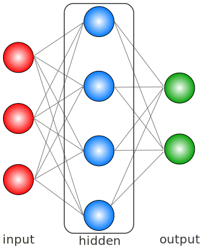
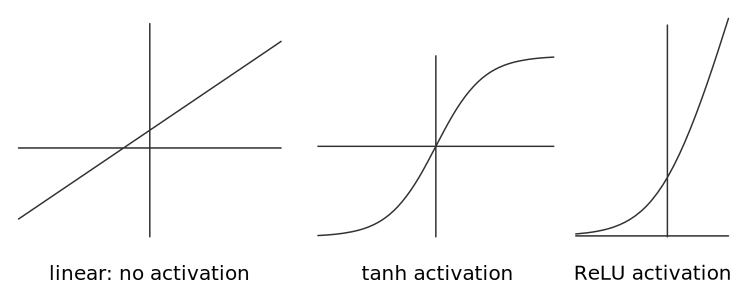

For a good while now, I’ve been interested in playing with and building Neural Networks (NN) and even composed some simple ones based on [Theano](http://www.deeplearning.net/software/theano/) and some instructive [blog posts](http://www.wildml.com/2015/09/speeding-up-your-neural-network-with-theano-and-the-gpu/). However, when starting to think about building a small and reusable library for my own use, I quickly noticed that my understanding of Neural Nets from an engineering point-of-view was limited. The better the abstractions and closed code units the higher the reusablity and plugabilty and hence the joy of playing with these tools.

So, what is a good engineering way of thinking about Neural Networks? Mathematically, simple NNs --such as feed-forward networks-- are nothing else than chained non-linear variable transformation. Let's begin to take this statement apart. To begin with, feed-forward networks (FFN) can be visualized as a graph with arrows going only in one direction, indicating a directed flow of information and hence implying a causal relation between the input and output/target variables.

### Neurons, Layers and Activations
The graph has some hierarchical structure in it, where the nodes are called **units or neurons** and the collection of neurons within a level form a **layer**. The size of the input layer corresponds to the number of features in the input data and its dimension equals the number of input data we are trying to learn from. The final level is the output layer with a size corresponding to the dimensionality of the target variable we are interested in (e.g. for a binary classification we have two units -- one for each class). The full magic of FFNs happen in between these two layers, i.e. in the hidden layers. Within such a layer, the input of the previous layer is being processed and the output is being fed forward as input to the next layer until we arrive at the final output layer. For a single layer $i$, we can write the processing as a simple matrix multiplication

$$
y_i = W_i y_{i-1} + b_i,
$$

where $y_i$ is the output of layer $i$ (a vector of dimension $n_i$) and the matrix $W_i$ (size $n_i \times n_{i-1}$) contains the weights of layer $i$ and $b_i$ is a bias vector. If this was the whole story of NNs it would be quite boring as we could just string all the matrix multiplications together and get the solution

$$
y_i = \left[\prod_{k=1}^i W_k\right] y_0 + \tilde b_i
$$

which is of the same linear form as the previous equation (note that $\tilde b_i \neq b_i$). As a consequence, such a model would not be well suited for learning any complex non-linear function. This is where the analogy with the [biological neuron](https://en.wikipedia.org/wiki/Biological_neuron_model) comes into the mix: Neurons only [fire](https://en.wikipedia.org/wiki/Action_potential), i.e. generate output, if the **activation** input is above a certain threshold. Additionally, their output is not arbirarily large (contray to the linear functions we have above). To achieve the same behavior for our artifical NN we need to transform the output of a layer in a non-linear way, i.e. we need to modify the input to the next layer according to 

$$
y_i = \varphi_i(W_i y_{i-1} + b_i).
$$

$\varphi_i(x)$ is called the activation function and there are several different ones that are being used in practice, such as [ReLUs](https://en.wikipedia.org/wiki/Rectifier_(neural_networks)) (rectified linear units), [Sigmoids](https://en.wikipedia.org/wiki/Sigmoid_function), [SoftMax](https://en.wikipedia.org/wiki/Softmax_function), [Heaviside](https://en.wikipedia.org/wiki/Heaviside_step_function), [Tanh](https://en.wikipedia.org/wiki/Hyperbolic_function), and many more. Some of them are depicted in the graph above and demonstrate their impact on a linear function. Iterating this relation it becomes clear that we now have a chain of non-linear transformations:

$$
y_i = \varphi_i \big(W_i \varphi_{i-1} (W_{i-1} \varphi_{i-2}(...) + b_{i-1}) + b_i\big).
$$

The goal of the NN is to learn the weights $W_i$ and the biases $b_i$ for a given sample set, so that it can give the most accurate answer to a new, previously unseen sample.

### Loss Functions and Minimization Procedures
To 'learn' the data and give reasonably accurate answers for the new samples, we need to define an objective/cost function that determines what good learning is. If $y_i$ is the actual target variable and $\hat y_i$ is the prediction we want to minimize the deviations of the predictions from the actual outcome and want to penalize those deviations. If $\ell(y_i, \hat y_i)$ denotes that penalty then a well trained model minimizes the total loss

$$
J({W_i}, {b_i}) =  \frac{1}{N} \sum_i^N \ell(y_i, \hat y_i).
$$

Hence learning can be described as a minimization procedure where the best learned parameters $W_i^*$, $b_i^*$ are given by

$$
J({W_i^*}, {b_i^*}) =  min[J({W_i}, {b_i})]
$$

The most commonly used loss function (for continuous outputs) is the squared error loss $\ell_\text{MSE}(y_i, \hat y_i) = (\hat y_i - y_i)^2$, which can be motivated through various different ways, but mainly has advantages when it actually comes to numerically finding the optimal values $W_i^*$, $b_i^*$. Procedures to find those values are numerous, such as [steepest gradient descent](https://en.wikipedia.org/wiki/Gradient_descent), [stochastic gradient descent](https://en.wikipedia.org/wiki/Stochastic_gradient_descent) and [conjugate gradient descent](https://en.wikipedia.org/wiki/Conjugate_gradient_method) to just name a few. All these techniques fall into the much broader category of [optimization](https://en.wikipedia.org/wiki/Mathematical_optimization).

### The Network itself - stringing it all together
Finally we need to tie everything up in an over-arching structure that takes the input and feeds it into the network and either triggers the minimization or predicts an outcome from a new sample input. Basically it should only delegate the work and be a central place-holder for all the ingredients. With this all pieces are into place to build a useful system of abstractions to think about:

* The network:
	* contains a list of layers
	* contains references to the outputs of the final layer
	* has a `train` function to learn the $W_i$'s and $b_i$'s from a given training set using a loss function.
	* has a `predict` function for predicting the target values of a new sample

* A single layer:
	* has $m$ neurons and thus $m$ outputs
	* hence the weight matrix $W$ is of dimension $m\times n$, where $n$ is the number of outputs of the previous layer
	* has a bias vector $b$ of length $m$
	* has an activation function $\varphi$ (we assume that all neurons of a layer have the same activation)

* The loss function:
	* defines the optimization to be done, i.e. what it means to 'learn the best representation of the data'
	* might contain a regularization, in which case it needs to know about the weights.
	* contains the implementation of the optimization procedure, e.g. gradient descent, etc. This optimizes the learning for a given loss function

There is an argument to be made that the loss function should be part of the layer, as there are different types of layers for different problems, e.g. for so-called Mixture Density Models. However, I think it is better to have several types (think of interfaces) of loss functions that can be plugged into the layers, which might only accept certain types of loss function implementations. This increases the modularity and reusability.

### Final words ...
I wrote a [small library](https://github.com/jotterbach/SimpleNeuralNets) for personal use with these guidelines in mind (contributions are of course more than welcome!). The layout does not (yet!) quite adhere to the above abstractions (python's base classes are not quite as powerful as Java interfaces it seems and I need to figure that out), and is hence not quite as flexible. I hope to improve and refactor it over time as I go along and explore different Neural Networks.

For the implementation I used [Theano](http://www.deeplearning.net/software/theano/) as it has some useful predefined abstractions and lets you easily transfer the algorithms to run on a GPU. For completnes I also want to point out other popular libraries in the open source wilderness, such as [Keras](http://keras.io/), [Lasagne](http://lasagne.readthedocs.org/en/latest/) and [Caffe](http://caffe.berkeleyvision.org/).

Starting to properly engineer Neural Networks definitely boosted my understanding of them -- it improved the actual understanding of how things fit together in detail and boosted the intuition about why they work the way they do. I can only encourage everyone to do this as well and not only stick with one-off-hacks to build these systems.
