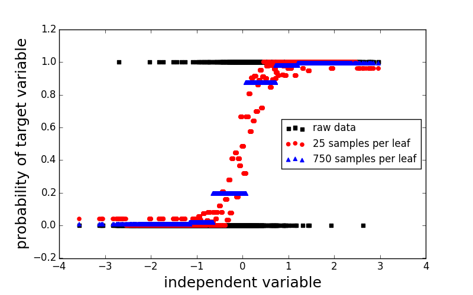
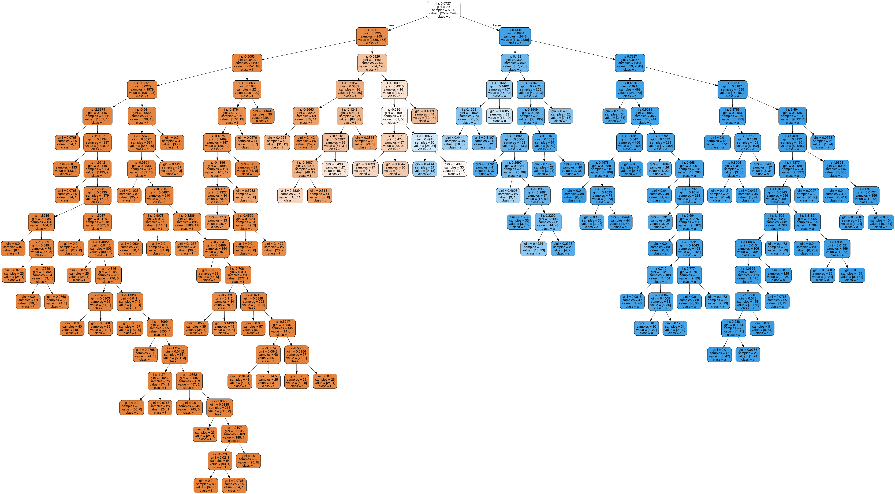
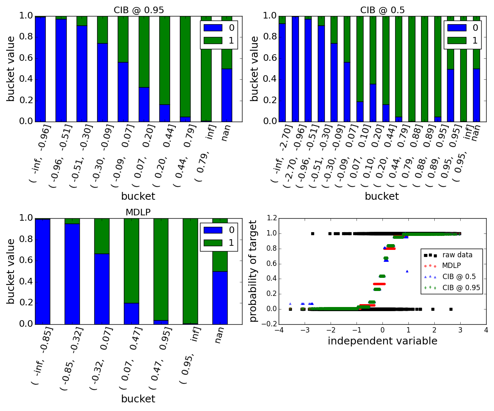

## Motivation
It's been quite a while since my last post and lots has happened on my [side project](https://github.com/jotterbach/dstk) and I would like to start talking about some of recent additions that I made.

A problem that I ran into when trying to implement learning algorithms that leverage [Gradient Boosted Trees](https://en.wikipedia.org/wiki/Gradient_boosting#Gradient_tree_boosting)[^fn-GAM] is how to prevent the trees from overfitting but still learn good representations of the underlying data. The requirement of a "good representation" is actually close to the heart of the problem as it strongly depends which metric (accuracy, precision-recall, etc.) we want to optimize.

Conceptually, growing a [decision tree](https://en.wikipedia.org/wiki/Decision_tree_learning) is simple. To illustrate the process assume we have a binary classification problem with only a single independent variable. Then building a decision tree can be described with the following recursive algorithm:

1. Sort the data and target variables
1. Evaluate a splitting criterion that splits the independent variable into two subsegments $A$, $B$
1. While still splittable: repeat the above steps on both segments $A$, $B$


There are two main ingredients for building a tree:

- A **splitter** that decides on a good split between the segments
- A **stopper** that decides when to terminate the recursion

Without a good stopper we can easily convince ourselves that the recursion terminates latest when each leaf is pure, i.e. there is no mixed examples in a leaf[^fn-edge-case]. However, it is also easy to see that this approach does not necessarily generalize very well and will in general lead to overfitting. On the other hand, a bad splitter might lead to very imbalanced trees or overly agressive or conservative splits and hence miss the optimal point for maximizing the discriminatory power of the independent variable.



An example of this can be seen in the above figure where the complexity of the tree was limited by forcing the terminal leaves to have at least a certain number of samples to stop further splits. For small numbers the trained classifier is very noisy and the probabilities are far from monotonically increasing, opposing the trends the data suggests. For a large number of records per leaf the classifier is overly conservative and does not produce very accurate splits. Moreover, forcing the minimal the number of records per terminal leaf is a variant of top-down pruning, which generally does not produce good trees and is not recommended as a regular use case.
The effect of overfitting can be seen in the image below which corresponds to the tree with at least 25 samples per leaf.



This demonstration should motivate us to think about ways how to prevent this kind of overfitting and still find splits and leafs that produce highly predicitve partitions. Two methods that provide powerful splitters  will be discussed in this blog: the [Minimum Description Length Principle](https://en.wikipedia.org/wiki/Minimum_description_length) (MDLP) and the [Conditional Inference Framework](http://statmath.wu-wien.ac.at/~zeileis/papers/Hothorn+Hornik+Zeileis-2006.pdf). Both are implemented in the `FeatureBinning` module of the [DSTK](https://github.com/jotterbach/dstk) project

## Minimum Description Length (MDL)

Lets start with a quote to introduce MDLP

> [The MDL Principle] is based on the following insight: any regularity in a given set of data can be used to compress the data, i.e. to describe it using fewer symbols than needed to describe the data literally." (Grünwald, 1998)

The [MDLP](https://en.wikipedia.org/wiki/Minimum_description_length) is a form of [Occam's Razor](https://en.wikipedia.org/wiki/Occam%27s_razor), and can be interpreted in our case as follows: Any representation that maximizes the information content of the data while compressing it maximally is a good criterion for splitting the data. With this we can boil the principle down to an information theoretic measure, closely related to the Shannon entropy. [Fayyad et al.](http://hdl.handle.net/2014/35171)[^fn-fayyad] present a fairly straight forward description of how to implement MDLP. Instead of focusing on the best compression they focus on the average compression of a binary code resulting in the

### MDLP splitter
To split a given set of labels, we simply use the "standard" entropy criterion used to build simple decision trees. After sorting the target according to the values of the independent variable we search the split that maximizes the *Information Gain*:

$$
\textrm{IG} \,=\, \textrm{Ent}(S) - \frac{|S_1|}{|S|} \textrm{Ent}(S_1) - \frac{|S_2|}{|S|} \textrm{Ent}(S_2)
$$

where the entropy is defined as $\textrm{Ent}(S) = -\Sigma_i p_i \textrm{log}_2(p_i)$. The entropy of a sequence (or distribution defined by the sequence) gives us a measure of disorder of the sequence. The smaller it is the more ordered it is and hence the more information it contains. Consequently the $IG$ can be interpreted as the amount of disorder we can eliminate by splitting the set $S$ into smaller sets $S_1$ and $S_2$.

Let's consider a short example to clarify this point:

```python
Full array: [0, 0, 0, 0, 1, 0, 1, 1, 1]
Entropy: 0.68696157659732338

Split arrays:  [0] [0, 0, 0, 1, 0, 1, 1, 1]
Entropy S_1: 0.0
Entropy S_2: 0.69314718056
Information Gain:  0.0708307494329


Split arrays:  [0, 0] [0, 0, 1, 0, 1, 1, 1]
Entropy S_1: 0.0
Entropy S_2: 0.6829081047
Information Gain:  0.155810828497


Split arrays:  [0, 0, 0] [0, 1, 0, 1, 1, 1]
Entropy S_1: 0.0
Entropy S_2: 0.636514168295
Information Gain:  0.262618797734


Split arrays:  [0, 0, 0, 0] [1, 0, 1, 1, 1]
Entropy S_1: 0.0
Entropy S_2: 0.500402423538
Information Gain:  0.408960230187


Split arrays:  [0, 0, 0, 0, 1] [0, 1, 1, 1]
Entropy S_1: 0.500402423538
Entropy S_2: 0.562335144619
Information Gain:  0.159033499246


Split arrays:  [0, 0, 0, 0, 1, 0] [1, 1, 1]
Entropy S_1: 0.450561208866
Entropy S_2: 0.0
Information Gain:  0.386587437353


Split arrays:  [0, 0, 0, 0, 1, 0, 1] [1, 1]
Entropy S_1: 0.598269588585
Entropy S_2: 0.0
Information Gain:  0.221640785475


Split arrays:  [0, 0, 0, 0, 1, 0, 1, 1] [1]
Entropy S_1: 0.661563238158
Entropy S_2: 0.0
Information Gain:  0.0989053649013
```

Here we considered all possible splits of the full array and calculated the $IG$ we get from that split. Following the numbers we see that the optimal split is after the 4th zero. We also recognize that $S_2$ still has entropy larger than zero and hence we can continue to further split this set into smaller sets. 

We see that this process only terminates when all subsets are pure, i.e. all sets have zero entropy. This means that the corresponding tree might be very deep and horribly overfit. This is where the MDLP stopping criterion comes into play.

### MDLP stopper
To obtain a stopping criterion we need a cost that is associated with either operation of splitting or not-splitting the set $S$. In the following we refer as not-splitting $S$ as the *Null Theory* (NT) and the splitting event as the *Hypothesis* (HT). It is intuitively clear that we would accept a split if

$$
\textrm{Cost}(HT) < \textrm{Cost}(NT)
$$

To define the costs we can calculate the amount of information needed to describe the set $S$. The basic unit of information in the set is given by its entropy $\textrm{Ent}(S)$. There are $\vert S\vert$ records in the set and if there are addidional $k$ classes we need to encode these as well. Hence the cost of NT is

$$
\textrm{Cost}(NT) \,=\, (|S|+k) \cdot \textrm{Ent}(S)
$$

Similarly we can calculate the cost of HT as

$$
\textrm{Cost}(HT) \,=\, (|S_1| + k_1) \textrm{Ent}(S_1) + (|S_2|+k_2) \textrm{Ent}(S_2) \\ \qquad + \textrm{log}_2(|S|-1) + \textrm{log}_2(3^k -2)
$$

where  $k_1, k_2$ are the number of classes that are present in the respective set and the additional terms account from encoding the information about the split (for details see the paper by Fayyad et al [^fn-fayyad]). The remainign piece is to investigate when $\textrm{Cost}(NT) - \textrm{Cost}(HT) < 0$, i.e. when to stop splitting; munging this together with the definition of $IG$ we find that the MDLP stopping criterion tells us to *reject the split iff*

$
\textrm{IG} \leq \frac{1}{|S|}\left[\textrm{log}_2 (|S|-1) + \textrm{log}_2(3^k -2) -\left[k \textrm{Ent}(S) - k_1\textrm{Ent}(S_1) - k_2 \textrm{Ent}(S_2) \right]\right]
$

This criterion can be undestood quite intuitively -- it tells us to stop splitting if the additional information gained does not outweigh the information needed to describe the split, or, put in other words, it gives us a measure of the basic noise in the set and encourages us to stop splitting if the information gain is smaller than the intrinsic noise of the set.

The MDLP splitting criterion is very conservative; some datasets exhibit moderate noise and hence the MDLP will find only very few (if any) partitions. This is true irrespective of the correlation between the dependent and independent variable as only the entropy of the label is important. It is hence sometimes helpful to have an alogrithm that will decide a split by taking the correlation with the independent variable into account. We will look at such an algorithm in the next section.

## Conditional Inference Partitioning (CIP)

As mentioned above there are situation when we would like to take the information of the independent and dependent variables into account when deciding on a split of a dataset. A scalabale and straight forward way to do this is to calculate a simple correlation such as the [*Pearson's r*](https://en.wikipedia.org/wiki/Pearson_product-moment_correlation_coefficient) coefficient 

$$
\rho_{X,Y}\,=\, \frac{\textrm{cov}(X,Y)}{\sigma_X\sigma_Y}
$$

where $\sigma_{i}$ denotes the standard deviation of $X$ or $Y$ and $\textrm{cov}(X,Y)$ is the covariance between the two. To arrive at a partitioning scheme we need one additional insight: Ultimately, we would like to assign each value to a class. Hence it makes sense to calculate the correlation between the actual label and the assigned category, instead of the raw feature value. By identifying the assigment rule (i.e. the split) that maximizes the (absolute value of the) correlation we found an important cluster that we can use to split the data into subsets. This leads us to the

- **CIP split criterion:** For every possible split $t$ calculate Pearson's r between $(\mathbb{1}(x_i \in S_1))_i$[^fn-support_func] and the target $(y_i)_i$ where $y_i \in \{0,1\}$ and $S_1 = \{x_i \leq t \vert x_i \in X\}$. Choose $t^*$ that belongs to the maximal correlation.

Every split reduces the correlation within the subsets leading to increasingly "similar" cluster. However, we do not want to split infinitely and hence need a criterion to stop the recursion. To address this let us first explicitly state the hypothesis set of the partitioning scheme:

- NT (a.k.a. $H_0$): The data points at hand are highly correlated and hence the probability of them belonging to different subset is high. Consequently, perform split operation to find the two subsets.
- HT: The data points are weakly correlated and the probability of the data belonging to different sets (cluster) is small. Stop splitting any further.

Intuitively this makes sense: If we have a highly correlated dataset then we can naturally think of data points that can be grouped into subset and contain some information about the classes. On the other hand, if the data is uncorrelated then we cannot expect a split to introduce correlation (except for random ones) or to produce new information from noise. Hence, recursively partitioning until the data becomes "sufficiently" uncorrelated is a meaningful mental concept.

To assess what low and reasonably high probabilities are to assess uncorrelated data, we can employ the [p-value (pv)](https://en.wikipedia.org/wiki/P-value) of Pearson's r coefficient which can be computed using permutation testing [^fn-scipy]. In all generality, the p-value represents the probability of NT to be true[^fn-pearsonr], i.e. the dataset is sufficiently correlated to merrit a split. In other words a small p-value indicates we should accept the HT, i.e. the data belongs to the same set and hence we stop splitting. The p-value analyis requires a predefined [significance level](https://en.wikipedia.org/wiki/Statistical_significance) $\alpha$ which sets a threshold to either accept or reject NT. With this we found the

- **CIP stopping criterion:** If $pv<\alpha$ reject NT and stop splitting. Note that in this case the correlation and the associated p-value are calculated using the original data (as opposed to the class-assigned representation).

To gain some intuition for this criterion we use a small example again:

```python
data:    [-1.97 -1.41 -1.32 -0.91 -0.85  0.    0.51  0.66  1.15  1.3 ]
target:  [0 0 0 0 0 1 1 1 1 1]


Split: -1.41
Class Assignment: [1 1 0 0 0 0 0 0 0 0]
Pearson r: -0.50
p-value: 0.859


Split: -1.32
Class Assignment: [1 1 1 0 0 0 0 0 0 0]
Pearson r: -0.65
p-value: 0.960


Split: -0.91
Class Assignment: [1 1 1 1 0 0 0 0 0 0]
Pearson r: -0.82
p-value: 0.996


Split: -0.85
Class Assignment: [1 1 1 1 1 0 0 0 0 0]
Pearson r: -1.00
p-value: 1.000


Split: 0.0
Class Assignment: [1 1 1 1 1 1 0 0 0 0]
Pearson r: -0.82
p-value: 0.996


Split: 0.51
Class Assignment: [1 1 1 1 1 1 1 0 0 0]
Pearson r: -0.65
p-value: 0.960


Split: 0.66
Class Assignment: [1 1 1 1 1 1 1 1 0 0]
Pearson r: -0.50
p-value: 0.859


Split: 1.15
Class Assignment: [1 1 1 1 1 1 1 1 1 0]
Pearson r: -0.33
p-value: 0.653
```

In this toy example the optimal split would be $t^* = -0.85$ and we would not have to split any further. In general we recursively continue with all subsets until we reject all further splits.

The number of splits can be influenced by the choice of the significance level $\alpha$. A small value of $\alpha$ indicates that we need an even smaller p-value to reject NT (i.e. the probability of the data to be correlated needs to be small). As NT encodes the probability of the underlying data to be correlated, a small $\alpha$ requires us to have a large probability for the underlying data to be uncorrelated (i.e. $1-pv$ is large) and thus reject further splitting. This typically means that a small significance level introduces more splits as those are necessary to sufficiently reduce the correlation within the subsets.

A larger significance level will reject splits earlier as we are fairly confident that even a relatively large corrleation probability (p-value) is sufficient for NT to be rejected[^fn-significance-level].

## Toy Example for Visualization

Both, [MDLP](http://hdl.handle.net/2014/35171) and [CIP](http://www.tandfonline.com/doi/abs/10.1198/106186006X133933), have their use cases and I implemented both in the Data Science Toolkit ([DSTK](https://github.com/jotterbach/dstk/FeatureBinning)). To visualize their differences lets consider the toy example from above to visualize the tree overfitting. Running the same data through the two algorithms they produce the following partitions:



At a 95% significance level the CIP scheme produces slightly more bins than the MDLP scheme, however it seems that the bins slope also slightly more gradual. This can be confirmed when looking at the probability plots. While MDPL is very conservative, but still sensible in its steps (as opposed to sample-size limited trees), the CIP @ 0.95 looks like a very good step-function approximation of a sigmoid.

Looking at a 50% significance interval we see that CIP produces more bins and the probabilities do not slope as linear anymore. Nevertheless, the overall trend is still very clear and the overfitting is minimal and mostly limited to the edges (per visual assessment). With more data the reduced significance level will be likely to produce a good representation of the underlying probabilities.

## Final words

As you get deeper into algorithms involving decision trees, e.g. Random Forest, Gradient Boosted Trees, etc., it becomes more and more important to understand how the underlying algorithm approach splitting the data and what good strategies are to prevent it from overfitting. On the other hand if you have noisy data it might also be worthwhile to discretize the data before continuing to process the data. To continue investigating the properties of the two strategies, MDLP and CIP, that we discussed here feel free to explore the obligatory [IPython Notebook](https://github.com/jotterbach/Data-Exploration-and-Numerical-Experimentation/blob/master/Data-Analytics/MDLP_CIP_BLOG.ipynb).

ENJOY!

[^fn-GAM]: This will be the topic of another post about Generalized Additive Models.

[^fn-edge-case]: This includes the case where each leaf might only have a single example and the total number of leaves corresponds to the size of the dataset.

[^fn-fayyad]: U. Fayyad and K. Irani, *Multi-Interval Discretization of Continuous-Valued Attributes for Classification Learning*, JPL TRS (1992+). http://hdl.handle.net/2014/35171

[^fn-support_func]: $\mathbb{1}(x_i \in S_1)$ is $1 \Leftrightarrow x_i \in S_1$ else it returns $0$.

[^fn-scipy]: Note that [scipy](https://docs.scipy.org/doc/scipy/reference/generated/scipy.stats.pearsonr.html#scipy.stats.pearsonr) calculates an approximate 2-sided p-value using an incomplete Beta integral. If someone knows why this works, please let me know!

[^fn-pearsonr]: For the implementation of CIP in the [DSTK](https://github.com/jotterbach/dstk/FeatureBinning) library we use the native p-value of [`scipy.stats.pearsonr`](https://docs.scipy.org/doc/scipy/reference/generated/scipy.stats.pearsonr.html#scipy.stats.pearsonr) where the p-value represents the probability of the data to be uncorrelated, i.e. it is the probability of HT to be true!

[^fn-significance-level]: Technically the significance level is the probability of a type-I error that rejects NT even though it is true. In our case it would mean that we stop splitting even though there is more information to be gained from an additional split.

