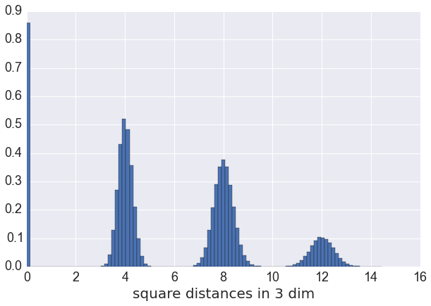
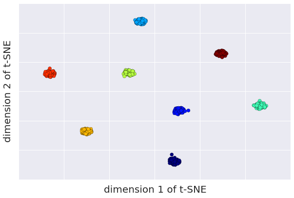
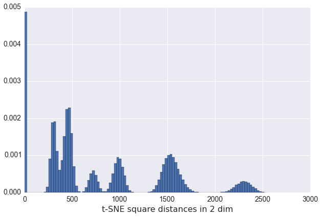
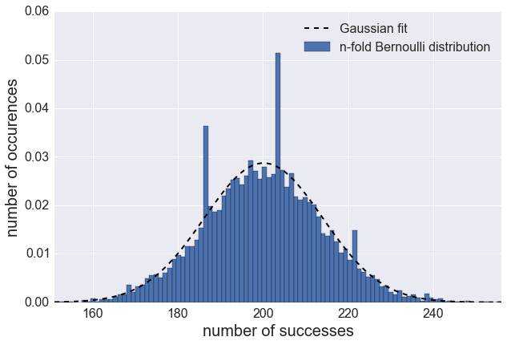
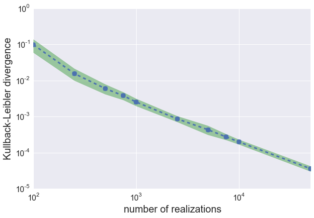

When working with data in high dimensional spaces [^fn-highDimSpace] our intuition is often misleading and can lead to dangerous fallacies. An example that is often quoted talks about ratio of the volume of a $d$-dimensional ball compared to the volume $d$-dimensional cube. As the dimension $d$ increases the volume quickly approaches zero, meaning that most of the volume in the cube lies outside the ball! To this end it is important to gain intuition about the data using visual tools and approximations. One such technique is the t-distributed stochastic neighbor embedding that is used to produce low-dimensional clustered distribution of the original data. In this post we look in more detail at t-SNE and its foundation the Kullback-Leibler divergence. The code to recreate the numerical experiments and generate all the plots encountered here can be [found in my github repository](https://github.com/jotterbach/Data-Exploration-and-Numerical-Experimentation/blob/master/Numerical-Experimentation/t-SNE%20and%20the%20KL%20Divergence.ipynb). Aso this blog has been turned into a [talk](http://jotterbach.github.io/presentations/TSNE_KL-divergence).

## Curse of Dimensionality
Let's try to break this down a little bit more. In one dimension the unit "ball" and the unit "cube" are in fact identical: It's just the real line from $-1$ to $1$. This starts to change in two dimensions: The "volume" of the two-dimensional cube is given by the area of a square, which in this case is $A_\square=4$. Correspondingly the volume of the 2D unit ball is just the area of a circle $A_{\tiny \bigcirc}=\pi$. The ratio between these two areas is $A_{\tiny \bigcirc}/A_\square \approx 0.785$, which we can interpret that about $21.5\%$ of the volume of the unit square lie outside the unit circle. Doing the same calculation in three dimensions we find $V_{\tiny \bigcirc} / V_\square \approx 0.524$ or already about $46.4\%$ of the volume are already outside of the unit ball!

In $d$-dimensions the ratio between the [d-dimensional unit ball](https://en.wikipedia.org/wiki/N-sphere) and its enclosing cube becomes

$$
\frac{ V_{ {\tiny \bigcirc}, d} }{ V_{\square, d}} =  \frac{\pi^{d/2}}{2^d \Gamma(1+d/2)} \\
\qquad \quad \approx \frac{\pi^{d/2}\text{e}^{(d/2) (1- \text{ln}d/2)} }{2^d} \stackrel{d\gg1}{\longrightarrow} 0,
$$

where $\Gamma(z)$ is the famous [Gamma function](https://en.wikipedia.org/wiki/Gamma_function). We can interpret this result as saying that with increasing dimensionality more and more of the volume of the unit cube lies outside the unit ball.

Alternatively, we can also think about it by drawing a unit-ball around a point in d-dimensional space. As the volume of this ball becomes smaller and smaller, the likelihood of finding another point within that volume vansihes as well. This is typically referred to as the [Curse of Dimensionality](https://en.wikipedia.org/wiki/Curse_of_dimensionality), where not only our intuition leaves us, but also where data is becoming so sparse that finding patterns becomes hard.

Nevertheless, or maybe just because, intuiton is not reliable we need tools to visualize the potential patterns of the data that arise in higher dimensions. One such tool is based on the idea of trying to match an effective probability distribution function -- we will discuss below what that means -- of the actual high dimensional data with a corresponding probability distribution in fewer (two or three) dimensions, which allows for better visualization. In this way we can get ideas of pockets, clusters, randomness, etc. and gain insight about what we should look out for in our modeling efforts.

## t-SNE: Visualization of high dimensional data
Enter t-SNE or _[t-distributed Stochastic Neighbor Embedding](https://lvdmaaten.github.io/tsne/)_: This technique introduces a probability function of the square Euclidean distances [^fn-tsne-metric], according to a softmax function:

$$
p_{ij} = \frac{\text{exp}(-||x_i-x_j||^2)}{\sum_{r\neq s}\text{exp}(-||x_r-x_s||^2)}
$$

The $x_j$ are vectors in the original space and we calculate the probability of finding two points $i, j$ at a distance $||x_i - x_j||$.

To get some intuition for this, we play with a [toy example](https://github.com/jotterbach/Data-Exploration-and-Numerical-Experimentation/blob/master/Numerical-Experimentation/t-SNE%20and%20the%20KL%20Divergence.ipynb), where we generate Gaussian ditrisbuted data clusters centered at the corners of a 3-dimensional cube with side-length $2$. We expect the distribution of square distances to be peaked around $0$, $4$, $8$, $12$, according to intra-cluster, side, face-diagonal and cube-diagonal separations (see figure to the left). This distribution can be understood as a probability distribution and the idea of t-SNE is to find a probability distribution that is a function of fewer coordinates (e.g. two instead of three) and creates a similar distribution function [^fn-complication]. To approximate the density function in the lower-dimensional mapping space, t-SNE employs a Student-t distribution [^fn-Cauchy] to match the corresponding distribution in the original space:

$$
q_{ij} =  \frac{(1+||y_i-y_j||^2)^{-1}}{\sum_{r\neq s}(1+||y_r-y_s||^2)^{-1}}
$$

The goal is to learn the coordinated $y_i$ of the low-dimensional space, such that the cluster distribution is preserved in the lowe-dimensional embedding space.

Using the [scikit-learn t-SNE implementation](http://scikit-learn.org/stable/modules/generated/sklearn.manifold.TSNE.html) we can quickly compute the t-SNE points for a 2-dimensional mapping space and visualize those using a scatter showning clearly distinguishable clusters! For completeness we should look at the underlying distance distriution. t-SNE is also doing a great job at distinguishing the clusters even in a more reduced version by just looking at the distances.

We can clearly identify 7 different distances (meaning we have one degenerate distance in mapping space) allowing us to easily identify structure in the data. For a different parameter set this might not be true and we could end up with overlapping distributions again, but looking at the t-SNE scatter should quickly resolve these ambiguities and inform us whether we actually have clusters in the data at hand.

## Kullback-Leibler: Measuring the dissimilarity of distributions

_Warning: This section is math heavy, feel free to skip it since it is not required to appreciate the power of t-SNE_

Up to now the notion of "matching two distributions" is fairly abstract and we should clarify its meaning. An often used measure for the similarity of two distribution is the [Kullback-Leibler (KL) divergence](https://en.wikipedia.org/wiki/Kullback-Leibler_divergence) $KL(P\vert \vert Q)$ that gives a numerical representation for the deviation of a model distribution $Q$ from the true distribution $P$ and is defined as:

$$
\text{KL}(P||Q) = \sum_i P_i \log \left( \frac{P_i}{Q_i} \right) \\
 = \sum_i P_i \log \left( P_i \right) - \sum_i P_i \log \left( Q_i \right) \\
 = - H(P) + H(P, Q).
$$ 

The last line gives an information-theoretic interpretation of the KL divergence, by observing that it measures the difference of the cross-entropy $H(P, Q)$ and the entropy of the of the true distribution $H(P)$. The cross-entropy can be understood as a measure of how much information the distribution $Q$ contains about the distribution $P$. With this the KL divergence tells us how much information we loose by using the approximation $Q$ instead of the true dostribution $P$

The KL divergence has several properties

- The KL divergence is positive semi-definite, i.e. $KL(P \vert \vert Q) \geq 0$
- If $P = P_1 \cdot P_2$ is a product of two independent distribution $P_1$, $P_2$ then the KL divergence decomposes into a sum of two parts $KL(P\vert \vert Q) = KL(P_1 \vert \vert Q_1) + KL(P_2\vert \vert Q_2)$, where $Q_1$, $Q_2$ are the approximations to their respective true distributions
- $KL(P\vert \vert Q)$ is **not** a metric, as it violates the triangle inequality $\vert \vert x + y\vert \vert \leq \vert \vert x \vert \vert + \vert \vert y\vert \vert$ and is not symmeric, i.e. $KL(P\vert \vert Q) \neq KL(Q\vert \vert P)$

This is all fair and well, but how does this look in practice; is that at all a useful measure and how can we compute it?
{: .text.img-left width="60%"}
To this end let's study one of my favorite stats theorems, the [central limit theorem](https://en.wikipedia.org/wiki/Central_limit_theorem).  E.g., given $n$-identically distributed Bernoulli variables $Y_i \sim \text{Bern} (p)$, then their sum approaches a Normal distribution. This can be seen in the figure to the right hand side, whee we used a Bernoulli distribution woth $p=0.02$ and $n=10,000$. [Drawing $10,000$ samples and making a histogram](https://github.com/jotterbach/Data-Exploration-and-Numerical-Experimentation/blob/master/Numerical-Experimentation/t-SNE%20and%20the%20KL%20Divergence.ipynb) looks fairly normal (see the black dashed fit), except for some outliers, that are due to the binning. Mathematically the central limit theorem for this example looks like:

$$
Y = \sum_{i=1}^n Y_i \rightarrow \mathcal{N} \big(np, np(1-p)\big)
$$

A question we might want ask is how fast the distribution converges to the true Normal distribution. With the KL divergence this is straight forward to answer in just a [few lines of code](https://github.com/jotterbach/Data-Exploration-and-Numerical-Experimentation/blob/master/Numerical-Experimentation/t-SNE%20and%20the%20KL%20Divergence.ipynb). We draw various numbers of samples using the same Bernoulli parameters from above and plot the Kullback-Leibler divergence against the sample size:
{: img width="550px"}

Note that the axes are both logarithmically. At about a sample size of $1000$ the convergence seems linear in this plot meaning that we converge towards a true Normal distribution with a power-law in the sample size. Which is **really** fast!

To put this in connection with t-SNE: With the KL divergence as a measure for similarity of two distribution we can now optimize the target distribution $q_{ij}$ by minimizing the KL divergence to the true high-dimensional distribution $p_{ij}$. Note however, that we are not generating new samples, but rather optimze the coordinates $y_i$ of the target distrbution. t-SNE generally does that using gradient-decent methods which are often (but not exclusively) used in [Neural Networks](http://jotterbach.github.io/2015/11/05/ExploringNeuralNetworkEngineering).

## Summary
The curse of dimensionality forces us to rethink the approach to high-dimensional data. One tool to gain insights into the distribution of the data is using the t-distributed stochastic neighbor embedding (t-SNE) that tries to maximize the similarity between two paramerterized probability distributions in the original high-dimensional space and the low-dimensional target (embedding) space. The similarity between the distributions is defined using the Kullback-Leibler divergence measure. All code is [found on github](https://github.com/jotterbach/Data-Exploration-and-Numerical-Experimentation/blob/master/Numerical-Experimentation/t-SNE%20and%20the%20KL%20Divergence.ipynb)

[^fn-highDimSpace]: Really, it starts already in 4 dimensions - just try to imagine that two infinitely large cubes will fit next to each other without touching or intersecting.

[^fn-tsne-metric]: One can generalize the procedure for other metrics that are better suited to represent the data.

[^fn-complication]: There is of course a complication as can be seen from the distribution of the cube clusters. There are in total 8 such clusters, but we see only 4 peaks. This is due to the degeneracy of some distances, such that they overlap in the distribution function. This is an example of the so-called _crowding problem_, but t-SNE is able to handle these overlaps to a certain extend, and resolve the individual clusters!

[^fn-Cauchy]: In fact we limit ourselves to one degree of freedom, which corresponds to a Cauchy distribution.

